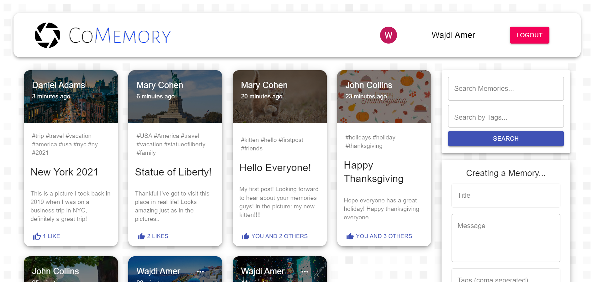

<a name="readme-top"></a>

[![Contributors][contributors-shield]][contributors-url]
[![Forks][forks-shield]][forks-url]
[![Stargazers][stars-shield]][stars-url]
[![Issues][issues-shield]][issues-url]
[![MIT License][license-shield]][license-url]
[![LinkedIn][linkedin-shield]][linkedin-url]

<!-- PROJECT LOGO -->
<br />
<div align="center">
  <a href="https://comemory.netlify.app/">
    
    
  </a>

  <p align="center">
    Collect Your Memories!
    <br />
    <a href="https://github.com/wajdi-amer/comemory"><strong>Explore the docs »</strong></a>
    <br />
    <br />
    <a href="https://github.com/wajdi-amer/comemory">View Demo</a>
    ·
    <a href="https://github.com/wajdi-amer/comemory/issues">Report Bug</a>
    ·
  </p>
</div>


<!-- TABLE OF CONTENTS -->
<details>
  <summary>Table of Contents</summary>
  <ol>
    <li>
      <a href="#about-the-project">About The Project</a>
      <ul>
        <li><a href="#built-with">Built With</a></li>
      </ul>
    </li>
    <li>
      <a href="#getting-started">Getting Started</a>
      <ul>
        <li><a href="#prerequisites">Prerequisites</a></li>
        <li><a href="#installation">Installation</a></li>
      </ul>
    </li>
    <li><a href="#roadmap">Roadmap</a></li>
    <li><a href="#contributing">Contributing</a></li>
    <li><a href="#license">License</a></li>
    <li><a href="#contact">Contact</a></li>
    <li><a href="#acknowledgments">Acknowledgments</a></li>
  </ol>
</details>


<!-- ABOUT THE PROJECT -->
## About The Project

<a href='https://comemory.netlify.app/'>
  
</a>

This website was developed to be some-kind of a social media app where you can share your Memories, like others and interact with your friends.
The project was developed using the MERN stack, and in the process I also learned and implemented Redux, JWT, Google OAuth and more...   

<p align="right">(<a href="#readme-top">back to top</a>)</p>


### Built With

* [![MongoDB][MONGODB-badge]][MONGODB-url]
* [![Express.js][EXPRESS-badge]][EXPRESS-url]
* [![React][React.js]][React-url]
* [![Nodejs][NODEJS-badge]][NODEJS-url]
* [![Redux][REDUX-badge]][REDUX-url]
* [![JWT][JWT-badge]][JWT-url]
* [![MUI][MUI-badge]][MUI-url]


<p align="right">(<a href="#readme-top">back to top</a>)</p>


<!-- GETTING STARTED -->
## Getting Started

To get a local copy up and running follow these simple example steps.

<br/>

### Prerequisites

* npm
  ```sh
  npm install npm@latest -g
  ```

* <a href='https://www.docker.com/'>Docker</a>

### Installation

1. Clone the repo

   ```sh
   git clone https://github.com/wajdi-amer/comemory.git
   ```

2. Rename '.env.example' in the server folder to simply '.env' 
3. Fill the environment variables with your own
4. Run Docker-Compose

   ```
     docker-compose up
   ```

5. Open 'localhost:3000' in your browser

<p align="right">(<a href="#readme-top">back to top</a>)</p>


<!-- ROADMAP -->
## Roadmap

- [x] Authentication System
    - [x] Sign up - (bcrypt)
    - [x] Local login - (jwt)
    - [x] Google login - (React OAuth2 | Google)
- [x]  Authorization system
    - [x] Role-based access control (editing/deleting own posts, liking others'...)
- [x]  User management - CRUD operations
    - [x] Creating Posts
    - [x] Deleting Posts
    - [x] Editing Posts
    - [x] Liking Posts
    - [x] ..and more
- [x] Search System, via:
  - [x] Title
  - [x] Tags
- [x] Pagination Support 
- [x] Routing
  - [x] Homepage, 404, Auth, Details, and more routes
- [ ] Comments System
- [x] Docker Support
- [x] Deployment

See the [open issues](https://github.com/wajdi-amer/comemory/issues) for a full list of proposed features (and known issues).

<p align="right">(<a href="#readme-top">back to top</a>)</p>


<!-- CONTRIBUTING -->
## Contributing

Contributions are what make the open source community such an amazing place to learn, inspire, and create. Any contributions you make are **greatly appreciated**.

If you have a suggestion that would make this better, please fork the repo and create a pull request. You can also simply open an issue with the tag "enhancement".
Don't forget to give the project a star! Thanks again!

1. Fork the Project
2. Create your Feature Branch (`git checkout -b feature/AmazingFeature`)
3. Commit your Changes (`git commit -m 'Add some AmazingFeature'`)
4. Push to the Branch (`git push origin feature/AmazingFeature`)
5. Open a Pull Request

<p align="right">(<a href="#readme-top">back to top</a>)</p>


<!-- LICENSE -->
## License

Distributed under the MIT License. See `LICENSE.md` for more information.

<p align="right">(<a href="#readme-top">back to top</a>)</p>


<!-- CONTACT -->
## Contact

Wajdi Amer - wajdi.amerrr@gmail.com

LinkedIn - https://www.linkedin.com/in/wajdi-am/

Project Link: [https://github.com/wajdi-amer/comemory](https://github.com/wajdi-amer/comemory)

<p align="right">(<a href="#readme-top">back to top</a>)</p>


<!-- ACKNOWLEDGMENTS -->
## Acknowledgments

* []()
* []()
* []()

<p align="right">(<a href="#readme-top">back to top</a>)</p>


<!-- MARKDOWN LINKS & IMAGES -->
<!-- https://www.markdownguide.org/basic-syntax/#reference-style-links -->
[contributors-shield]: https://img.shields.io/github/contributors/wajdi-amer/comemory.svg?style=for-the-badge
[contributors-url]: https://github.com/wajdi-amer/comemory/graphs/contributors
[forks-shield]: https://img.shields.io/github/forks/wajdi-amer/comemory.svg?style=for-the-badge
[forks-url]: https://github.com/wajdi-amer/comemory/network/members
[stars-shield]: https://img.shields.io/github/stars/wajdi-amer/comemory.svg?style=for-the-badge
[stars-url]: https://github.com/wajdi-amer/comemory/stargazers
[issues-shield]: https://img.shields.io/github/issues/wajdi-amer/comemory.svg?style=for-the-badge
[issues-url]: https://github.com/wajdi-amer/comemory/issues
[license-shield]: https://img.shields.io/github/license/wajdi-amer/comemory.svg?style=for-the-badge
[license-url]: https://github.com/wajdi-amer/comemory/blob/main/LICENSE
[linkedin-shield]: https://img.shields.io/badge/-LinkedIn-black.svg?style=for-the-badge&logo=linkedin&colorB=555
[linkedin-url]: https://linkedin.com/in/wajdi-am
[product-screenshot]: ./client/src/images/website_screenshot.png
[React.js]: https://img.shields.io/badge/React-20232A?style=for-the-badge&logo=react&logoColor=61DAFB
[React-url]: https://reactjs.org/
[MUI-badge]: https://img.shields.io/badge/-MUI-007fff?logo=mui&logoColor=white&style=for-the-badge
[MUI-url]: https://mui.com/
[MONGODB-badge]: https://img.shields.io/badge/-MongoDB-3F3E42?logo=mongodb&style=for-the-badge
[MONGODB-url]: https://www.mongodb.com/
[EXPRESS-badge]: https://img.shields.io/badge/-Express.js-3C873A?logo=express&style=for-the-badge
[EXPRESS-url]: https://expressjs.com/
[NODEJS-badge]: https://img.shields.io/badge/-Node.js-FFCC00?logo=node.js&style=for-the-badge
[NODEJS-url]: https://nodejs.org/en/
[REDUX-badge]: https://img.shields.io/badge/-Redux-8b0000?logo=redux&style=for-the-badge
[REDUX-url]: https://redux.js.org/
[JWT-badge]: https://img.shields.io/badge/-JWT-white?logo=jsonwebtokens&logoColor=black&style=for-the-badge
[JWT-url]: https://jwt.io/